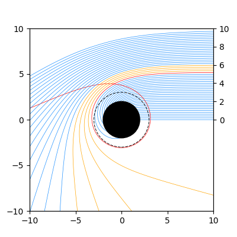

# GRAVITYp

**GRAVITYp** is a Python package to study the optical appearance of spherically symmetric compact objects in General Relativity. It stands for **G**eodesic **RA**ys and **V**isualization of **I**ntensi**TY** **p**rofiles. 

## About the project

**GRAVITYp** was originally a numerical code written in Wolfram language developed by G.J. Olmo, D. Rubiera-Garcia, J.L. Rosa and D. Sáez-Chillón. It was developed to study the optical appearance or *shadow* cast by black holes, wormholes and different kinds of exotic compact objects, and it was inspired by the work by S.E. Gralla et al. [arXiv:1906.00873](https://arxiv.org/abs/1906.00873).

Then, Á. Salazar-Cuadros preferred to work on Python seeking faster execution times for simulations and a language better suited for Version Control Systems (VCS), and that's how this project was born.

The goal of this open source version is provide open access to anyone interested in using the package or learning how simulated shadow images are generated.

## Installation

You can install `GRAVITYp` locally in editable mode for research and development:

```bash
git clone https://github.com/alvaroslzar/GRAVITYp.git
cd GRAVITYp
pip install -e .
```

## Usage

### Quick example

```python
import numpy as np
from gravityp import make_geodesics_plot

def g_rr(r: float, dummy) -> float:
    """Radial function g^{rr} of the Schwarzschild metric in units of M=1"""
    return 1 - 2./r

def g_thth(r: float, dummy) -> float:
    """Areal radius squared g^{theta theta} of the Schwarzschild in units of M=1"""
    return r**2

# Dictionary codifying Schwarzschild metric and required params
Schwarzschild_kwargs = {
    'r_phs': [3.,],         # Photon sphere at r=3M
    'inner_edge': 2.,       # Inner edge of disk at horizon r=2M
    'radial_fun': g_rr,     # Above defined radial function
    'radial_params': None,  # g_rr has no additional params
    'areal': g_thth,        # Above defined areal radius squared
    'areal_params': None,   # g_thth has no additional params
}

# Array of impact parameters from 0M to 10M
impact_parameters = np.arange(0,10,0.2)
make_geodesics_plot(impact_parameters, figsize=(4,4), **Schwarzschild_kwargs)
```

The output image looks like this:



For a more detailed explanation, check the Jupyter notebooks in the [Examples](Examples/) folder.

### Intensity profiles and black hole shadows

*Add emitted + observed + shadow*

### Further references

Watch Prof. D. Rubiera-García's [talk](https://www.youtube.com/live/q0a4RXdxk4o?si=njtj2yOmCwim25ix) for an overview of the main concepts involved in the ray-tracing method and analysis of intensity profiles.

For an introductory discussion of the inner workings of the Wolfram Mathematica code, watch Prof. G.J. Olmo's [tutorial](https://www.youtube.com/live/f5-s2gVd5xE?si=xCtJxFQikmkLehdU); while for a more user-friendly application, watch Dr. J.L. Rosa's [talk](https://www.youtube.com/live/9k8qMq9V814?si=MtXYMg0exd_6_37t).

Finally, for a more advanced topic regarding compact objects, watch Prof. D. Sáez-Chillón's [contribution](https://www.youtube.com/watch?v=8pR8kE_ABzQ).

## Citation

The use of **GRAVITYp** in scientific publications must be properly acknowledged. Please cite:

**BibTeX**
```
@software{Olmo_GRAVITYp_Geodesic_RAys_2026,
    author = {Olmo, Gonzalo J. and Rubiera-García, Diego and Rosa, João Luís and Sáez-Chillón Gómez, Diego and Salazar-Cuadros, Álvaro},
    license = {MIT},
    month = jul,
    title = {{GRAVITYp: Geodesic rays and visualization of intensity profiles}},
    url = {https://github.com/alvaroslzar/GRAVITYp},
    version = {0.0.1},
    year = {2026}
}
```

## Publications using GRAVITYp

Let us know if you use **GRAVITYp** in your publication and we'll add it to this list!

**Using the Python code**

- Horizon singularity and energy conditions in time-dependent and spherically symmetric spacetime, S. Nojiri et al., *In preparation*

**Using the original Wolfram Mathematica code**

- Observational signatures of negative mass wormholes through their shadows, S. Nojiri et al., [arXiv:2605.16177 [gr-qc]](https://arxiv.org/abs/2605.16177)

- Black bounce as a quantum correction from string T-duality: Thermodynamics, energy conditions, and observational imprints from EHT, G. Alencar et al., [arXiv:2603.05543 [gr-qc]](https://arxiv.org/abs/2603.05543)

- Twinkle twinkle dark star: Oscillating profiles from dark matter scalar solitons, N. Aimar et al., [arXiv:2512.23800 [gr-qc]](https://arxiv.org/abs/2512.23800)

- Multiphoton ring structure of reflection-asymmetric traversable thin-shell wormholes, C.F.B. Macedo et al., [arXiv:2510.19677 [gr-qc]](https://arxiv.org/abs/2510.19677)

- Shadows from thin accretion disks of parametrized black hole solutions, G.J. Olmo et al., [arXiv:2507.16580 [gr-qc]](https://arxiv.org/abs/2507.16580)

- Imaging compact boson stars with hot spots and thin accretion disks, J.L. Rosa et al., [arXiv:2303.17296 [gr-qc]](https://arxiv.org/abs/2303.17296)

- Shadows and photon rings of regular black holes and geonic horizonless compact objects, G.J.Olmo et al., [arXiv:2302.12064 [gr-qc]](https://arxiv.org/abs/2302.12064)

- Observational properties of relativistic fluid spheres with thin accretion disks, J.L. Rosa, [arXiv:2302.11915 [gr-qc]](https://arxiv.org/abs/2302.11915)

- Multiring images of thin accretion disk of a regular naked compact object, M. Guerrero et al., [arXiv:2205.12147 [gr-qc]](https://arxiv.org/abs/2205.12147)

- Light ring images of double photon spheres in black hole and wormhole spacetimes, M. Guerrero et al., [arXiv:2202.03809 [gr-qc]](https://arxiv.org/abs/2202.03809)

- New light rings from multiple critical curves as observational signatures of black hole mimickers, G.J. Olmo et al., [arXiv:2110.10002 [gr-qc]](https://arxiv.org/abs/2110.10002)

- Shadows and optical appearance of black bounces illuminated by a thin accretion disk, M. Guerrero et al., [arXiv:2105.15073 [gr-qc]](https://arxiv.org/abs/2105.15073)


## License

The software is licensed under the MIT license (see [LICENSE](LICENSE)).