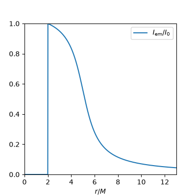
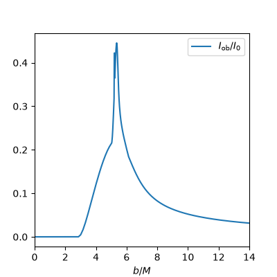
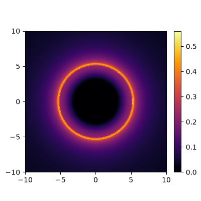

# GRAVITYp

**GRAVITYp** is a Python package for studying the optical appearance of spherically symmetric compact objects in General Relativity.
It stands for **G**eodesic **RA**ys and **V**isualization of **I**ntensi**TY** **p**rofiles. 

## About the project

This is the Python implementation of **GRAVITYp**, which is originally a numerical code in Wolfram language developed by G.J. Olmo, D. Rubiera García, J.L. Rosa, D. Sáez-Chillón and collaborators [arXiv:2307.06778v2](https://arxiv.org/abs/2307.06778v2).
It was developed to study the optical appearance or *shadow* cast by black holes, wormholes and different kinds of exotic compact objects, inspired by the work of S.E. Gralla et al. [arXiv:1906.00873](https://arxiv.org/abs/1906.00873).

Then, Á. Salazar Cuadros preferred to work on Python seeking faster execution times for simulations and a language better suited for Version Control Systems (VCS), and that's how the Python implementation was born.
The goal of this open source version is to provide open access to anyone interested in using the package or learning how simulated black hole shadow images are generated.

## Installation

**GRAVITYp** is available on [PyPI](https://pypi.org/project/gravityp/)

```bash
pip install gravityp
```

Alternatively, you can [fork this repository](https://github.com/alvaroslzar/GRAVITYp/fork) and clone it locally in editable mode for research and development

```bash
git clone git@github.com:<YOUR_USERNAME>/GRAVITYp.git       # SSH
git clone https://github.com/<YOUR_USERNAME>/GRAVITYp.git   # HTTPS
```

Then, install it

```bash
cd GRAVITYp
pip install -e .
```

## Usage

### Quick example

```python
import numpy as np
from gravityp import make_geodesics_plot

def g_rr(r: float, dummy) -> float:
    """Radial function g^{rr} of the Schwarzschild metric in units of M=1"""
    return 1 - 2./r

def g_thth(r: float, dummy) -> float:
    """Areal radius squared g^{theta theta} of the Schwarzschild in units of M=1"""
    return r**2

# Dictionary codifying Schwarzschild metric and required params
Schwarzschild_kwargs = {
    'r_phs': [3.,],         # Photon sphere at r=3M
    'inner_edge': 2.,       # Inner edge of disk at horizon r=2M
    'radial_fun': g_rr,     # Above defined radial function
    'radial_params': None,  # g_rr has no additional params
    'areal': g_thth,        # Above defined areal radius squared
    'areal_params': None,   # g_thth has no additional params
}

# Array of impact parameters from 0M to 10M
impact_parameters = np.arange(0,10,0.2)
make_geodesics_plot(impact_parameters, figsize=(4,4), **Schwarzschild_kwargs)
```

The output image looks like this:


For a more detailed explanation, check the Jupyter notebooks in the [Examples](Examples/) folder for details.

### Intensity profiles and black hole shadows

The primary use is to obtain the observed intensity profile $I_\mathrm{ob}(b)$ as a function of the impact parameter $b$ given some predefined emission profile $I_\mathrm{em}(r)$.
The emitted light is due to the matter in the accretion disk, which is assumed to be both geometrically and optically thin.
Moreover, the orientation is assumed to be face-on with respect to the accretion disk, so the optical appearance has have rotational symmetry.

In the following images, the emission profile of the accretion disk has been chosen to peak at the event horizon $r=2M$, and the optical appearance corresponds to a Schwarzschild black hole.ç
The code properly reproduces the predicted light rings up to two intersections with the accretion disk, as well as the central brightness depression or *shadow* characteristic of compact objects such as black holes.





### Further references

Watch Prof. D. Rubiera García's [talk](https://www.youtube.com/live/q0a4RXdxk4o?si=njtj2yOmCwim25ix) for an overview of the main concepts involved in the ray-tracing method and analysis of intensity profiles.

For an introductory discussion of the inner workings of the Wolfram Mathematica code, watch Prof. G.J. Olmo's [tutorial](https://www.youtube.com/live/f5-s2gVd5xE?si=xCtJxFQikmkLehdU); for a more user-friendly application, watch Dr. J.L. Rosa's [talk](https://www.youtube.com/live/9k8qMq9V814?si=MtXYMg0exd_6_37t).

Finally, for a more advanced topic regarding compact objects, watch Prof. D. Sáez-Chillón's [contribution](https://www.youtube.com/watch?v=8pR8kE_ABzQ).

## Citation

The use of **GRAVITYp** in scientific publications must be properly acknowledged.
Please cite the following:

**BibTeX**
```
@article{Nojiri:2026tjn,
    author = "Nojiri, Shin'ichi and Odintsov, Sergei D. and S{\'a}ez-Chill{\'o}n G{\'o}mez, Diego and Cuadros, {\'A}lvaro Salazar",
    title = "{Horizon singularity, energy conditions and shadows in time-dependent and spherically symmetric spacetime}",
    eprint = "2608.15740",
    archivePrefix = "arXiv",
    primaryClass = "gr-qc",
    reportNumber = "KEK-TH-2861, KEK-Cosmo-0429",
    month = "8",
    year = "2026"
}
```

## Publications using GRAVITYp

Let us know if you use **GRAVITYp** in your publication, and we will add it to the [list of publications](/docs/PUBLICATIONS.md)!

## Author

The author and mantainer of the Python code is Álvaro Salazar Cuadros.

## License

The software is licensed under the [MIT license](LICENSE).